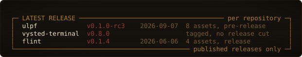
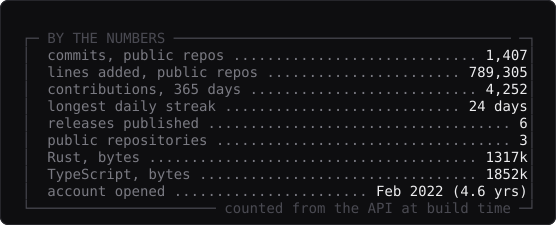

<!--
  stages: framed 1  stored 1  detected 1  parsed 1  normalized 1  emitted 1
  no_parser 0  parse_failed 0  utf8_lossy 0
  you are reading the raw bytes before anything interpreted them for you.
  that ordering is the whole idea. -- ulpf, and this file
-->

I'm 19, from Jaipur, and a first-year CS student at Shiv Nadar University on a 2+2 dual degree with Arizona State. I build primarily by driving Claude Code, which means most of my time goes on the parts that actually decide whether software is any good — what it should do, where the seams go, and whether a claim in a README survives someone checking it. Most of what I make is local-first desktop software: it runs on your machine, keeps its data in files you can read, and doesn't phone home.

## Open source

**[flint](https://github.com/techlogist1/flint)** — A desktop timer in which every timer mode is a plugin. Pomodoro, stopwatch and countdown aren't built in; they ship on the same sandboxed API any stranger would use, where plugins get lifecycle hooks and declarative render specs but have `window`, `document`, `fetch` and the Tauri internals shadowed to `undefined`. Sessions are plain JSON under `~/.flint/`, and nothing in the app makes a network call.
Tauri 2, React 18, TypeScript, Rust, SQLite as a rebuildable cache. MIT.
**v0.1.4 is published** with Windows and macOS installers. They aren't notarized, and Linux builds haven't been cut.

**[vysted-terminal](https://github.com/techlogist1/vysted-terminal)** — An open-source finance terminal an AI agent can actually drive. Three processes cooperate on one machine over loopback: a Rust core holding the windowing and the OS keychain, a Next.js panel cockpit, and a Python sidecar doing data and AI, with bundled MCP servers for OpenBB and SEC EDGAR. Bring your own keys across seven LLM providers; they live in the keychain and never touch disk.
Tauri 2, Next.js 16, React 19, Python 3.13, FastAPI, QuantLib. AGPL-3.0, commercial licence separate.
**No release cut yet.** Phases 0–10 are merged and the machine-checkable gates are green — 619 vitest, 942 pytest, the execution-safety audit 9 for 9 — but it ships unsigned with no release pipeline, and the live UX and broker round-trips are operator-verified rather than CI-verified. Broker connect is read-only; order execution exists in the code and is deliberately not enabled.

**[ulpf](https://github.com/techlogist1/ulpf)** — Takes logs off firewalls, IDS/IPS, proxies and VPN concentrators in fifteen vendor formats and turns them into one common schema — but stores every original byte *before* it tries to understand any of them. Each output line points back at the exact bytes it came from, and those bytes are SHA-256 chained, so a stranger can re-verify the whole store offline. Parsers speak the device's vocabulary and never name a schema field; mappings name schema fields and never name a vendor. When a format arrives that nothing recognises it isn't dropped — it's clustered into a proposed parser definition you approve in a browser, and approval activates it without a restart.
One static Rust binary, edition 2024, no runtime dependencies. OCSF and ECS output. MIT.
**v0.1.0-rc3 is published** — static binaries for Linux, macOS and Windows beside a `SHA256SUMS`, plus desktop installers.

## Shipping

**[Luminfaber](https://luminfaber.com)** — my B2B AI agency.
**[Vysted](https://vysted.com)** — college discovery built for the people actually applying.
**[rajkanwar.com](https://rajkanwar.com)** — an editorial site for my grandmother, a master textile artist. In production.

## By the numbers

## Currently building

ULPF is where the work is. `v0.1.0-rc3` went out with binaries for three platforms; what's left before `v0.1.0` proper is Windows path handling, a signed build, and a scorecard that re-pins the throughput number rather than leaving the faster figure sitting in the README unpromoted.

## Contact

[lokavya12@gmail.com](mailto:lokavya12@gmail.com) · [x.com/heyloksa](https://x.com/heyloksa) · [linkedin](https://www.linkedin.com/in/lokavya-singh-01b9b42a6/)
