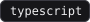
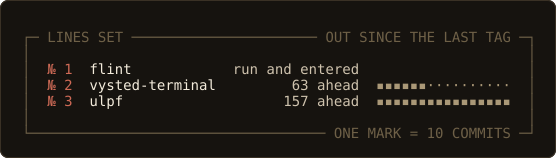
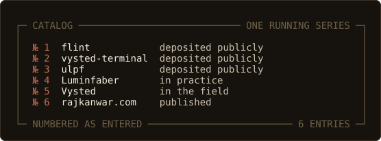
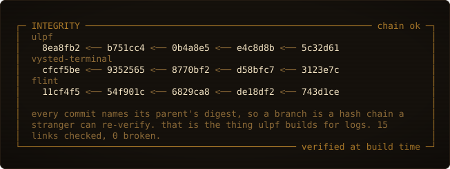
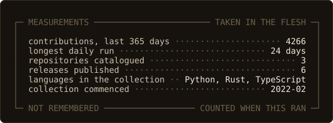

<!--
  A field notebook, kept in the Grinnell system: a dated journal, a set of
  running species accounts, and one numbered catalog covering everything.

  The accounts, the kit list, the plans and the deposited list are WRITTEN BY
  tools/generate.py from the GitHub API and data/accounts.toml, each between a
  pair of notebook marker comments. Do not hand-edit between a marker pair: the
  next run overwrites it. Open-sourcing a new project needs no edit to this file.

  Do not name a marker literally in here either. An HTML comment cannot nest,
  so the first closing arrow inside this block ends it and everything after it
  renders as body text at the top of the profile.

  Every plate is generated in this repository and committed here. No badge
  service, no widget host, nothing that can 404 out from under it.
-->

Every plate is redrawn from the API when the workflow runs and committed beside the last one, so no entry is overwritten without a record of what it said before.

## Conditions

**Jaipur · 26°55′N 75°47′E** · first-year CS at Shiv Nadar University, on a 2+2 with Arizona State · 19

I build desktop apps that run on your own computer, store their data in files you can open in a text editor, and keep working with the network off. Where a feature could cost you something, I ship it switched off: order execution disabled, no outbound connection, no telemetry. That is my call to make in the build rather than yours to find in a settings page.

## Outfit carried

Listed at the front, as the method requires: a measurement gets read back years after the day it was taken, and whoever reads it should know what it was taken with.

**In the bag** — <!--notebook:kit-->
  
<!--/notebook:kit-->
Each links to the work it was used on.

**On the wrist** — a mechanical watch, wound in the morning. It runs a few seconds a day off true, which is the tolerance it was built to.

**In the pocket** — an old fountain pen, filled. Every entry in this book is made with it.

**In the case** — 35 mm camera, 36 exposures to the roll. You find out a week later.

**On the shelf, for the morning** — Edwin Jagger double-edge, Proraso, one blade.

## Lines set

## Species accounts

One account per specimen, same fields in the same order. Everything known about it, accumulated across many days and kept apart from the dated entry above.

<!--notebook:accounts-->
 **[flint](https://github.com/techlogist1/flint)** — every timer mode is a plugin, including the three that ship with it  
    
Session files under ~/.flint/ are the record; the SQLite cache is an index and rebuilds from them on request. A plugin handed undefined for window, fetch and localStorage is the sandbox working.  

 **[vysted-terminal](https://github.com/techlogist1/vysted-terminal)** — a finance terminal an AI agent can drive  
    
Three processes on one machine, loopback only. Keys live in the OS keychain. The broker connection reads; order execution is fitted, switched off, and every attempt is written to an append-only log.  

 **[ulpf](https://github.com/techlogist1/ulpf)** — stores every original byte before it tries to understand any of them  
   
A format no parser claims is clustered into a candidate definition a human approves, and approval activates it without a restart. 258,411 events/s end to end, median of three runs over a 5,000,000-event file, scorecard committed.  
<!--/notebook:accounts-->

## Catalog

Everything gets a number; only some things get an account. The disposition does the separating.

<!--notebook:deposited-->
**[Luminfaber](https://luminfaber.com)** — B2B AI agency  
**Vysted** — college discovery, for the people actually applying  
**[rajkanwar.com](https://rajkanwar.com)** — editorial site for my grandmother, a master textile artist  
<!--/notebook:deposited-->

## Measurements, taken in the flesh

Taken from the fresh specimen rather than from a dried skin — counted when this ran, not remembered.

## Plans for tomorrow

<!--notebook:plans-->
**[flint](https://github.com/techlogist1/flint)** — signed macOS and Windows builds out of a single release workflow  
**[vysted-terminal](https://github.com/techlogist1/vysted-terminal)** — one plugin model for the whole terminal, so brokers, data providers, panels and agents install the same way  
**[ulpf](https://github.com/techlogist1/ulpf)** — Windows path handling and a signed build, heading for v0.1.0  
<!--/notebook:plans-->

Written for someone who was not there, which is the method's own rule and the only way I have found to be sure I understood a thing myself.

## In camp

90 ml of Glenlivet 12, two or three drops of water, no ice. Tame Impala, Mac DeMarco. Films where the clue was in plain sight from the first scene and you only see it on the second watch — *Kahaani*, *Andhadhun*, *Jaane Jaan*, and most of Nolan, Fincher and Villeneuve.

## If found, return to

[lokavya12@gmail.com](mailto:lokavya12@gmail.com) · [x.com/heyloksa](https://x.com/heyloksa) · [linkedin](https://www.linkedin.com/in/lokavya-singh-01b9b42a6/)
