<!--
  every image on this page is generated by tools/generate.py and committed to
  this repository. no badge service, no widget host, nothing that can 404 out
  from under it. the numbers are counted from the API when the workflow runs.
-->

I'm 19, from Jaipur, a first-year CS student at Shiv Nadar University on a 2+2 with Arizona State. I build desktop apps that run on your own computer, store their data in files you can open in a text editor, and keep working with the network off. Where a feature could cost you something, I ship it switched off: order execution disabled, no outbound connection, no telemetry.

## Open source

**[flint](https://github.com/techlogist1/flint)** — every timer mode is a plugin, including the built-in ones.  

  

**[vysted-terminal](https://github.com/techlogist1/vysted-terminal)** — a finance terminal an AI agent can actually drive.  

  

**[ulpf](https://github.com/techlogist1/ulpf)** — stores every original byte before it tries to understand any of them.  

  

## Shipping

**[Luminfaber](https://luminfaber.com)** — B2B AI agency.  
**Vysted** — college discovery for the people actually applying.  
**[rajkanwar.com](https://rajkanwar.com)** — editorial site for my grandmother, a master textile artist.

## By the numbers

## Currently building

**ulpf** — Windows path handling and a signed build, heading for `v0.1.0`.  
**vysted-terminal** — one plugin model for the whole terminal, so brokers, data providers, panels and agents all install the same way.  
**flint** — signed macOS and Windows builds out of a single release workflow.

## Contact

[lokavya12@gmail.com](mailto:lokavya12@gmail.com) · [x.com/heyloksa](https://x.com/heyloksa) · [linkedin](https://www.linkedin.com/in/lokavya-singh-01b9b42a6/)
